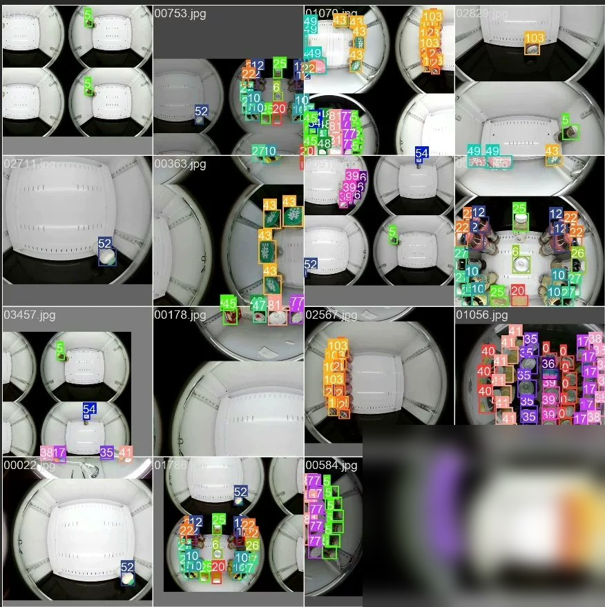
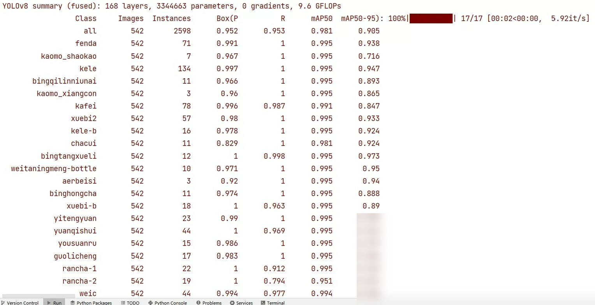
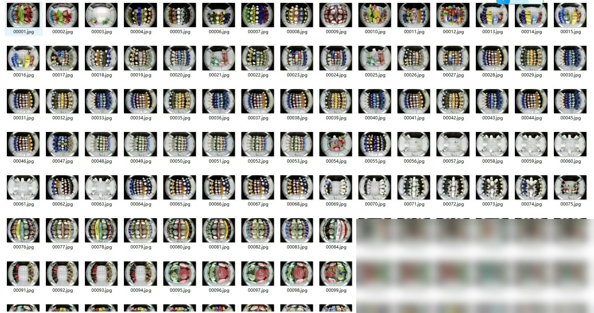
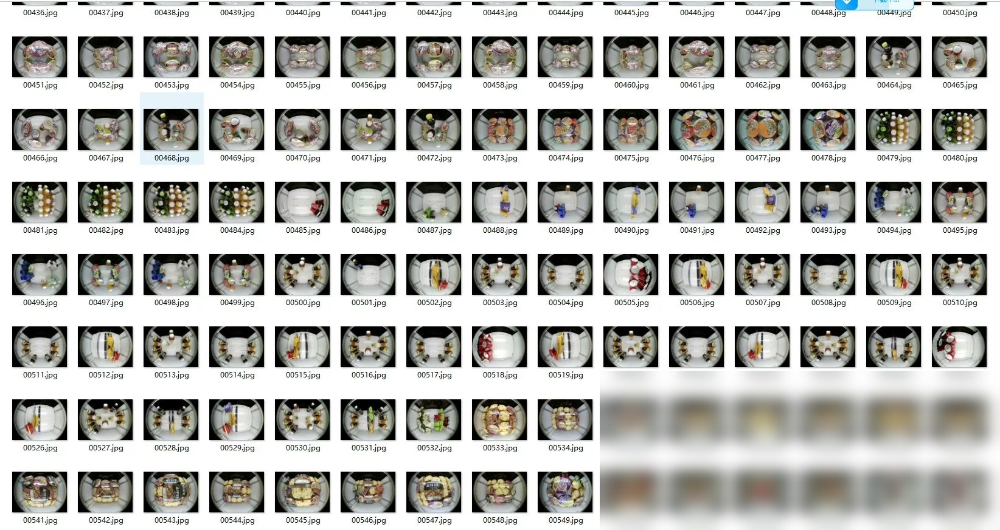
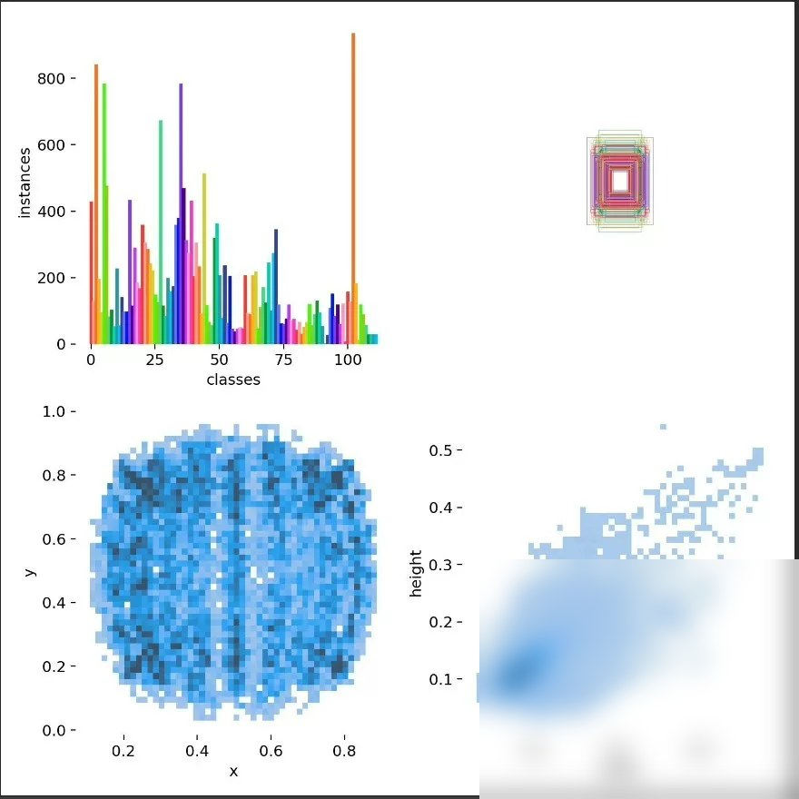
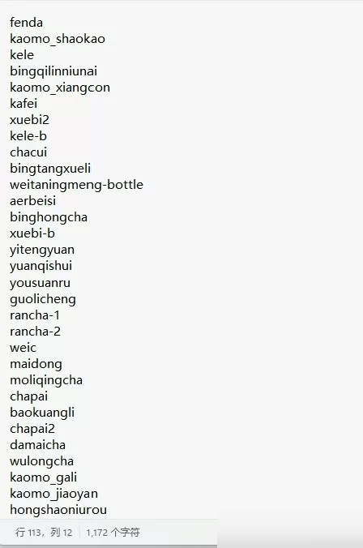
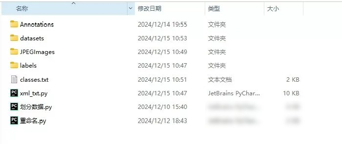
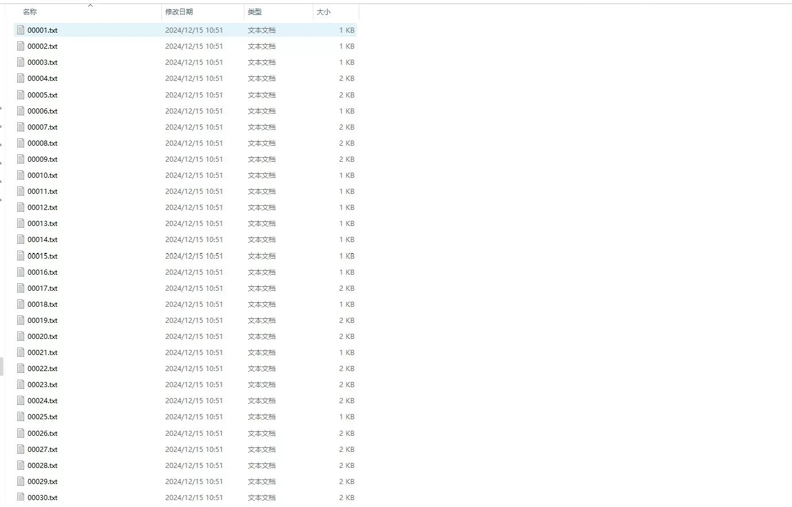

# Intelligent Retail Vending Machine Product Recognition Dataset】113 Categories Can be Used for Competitions in Internet of Things and Other Areas

# Body

Intelligent Retail Vending Machine Product Identification Dataset】113 classifications, suitable for use in IoT competitions.
Pictures total 5589, including 3 commonly used scripts.
The dataset is allocated as 7:2:1.
Among them, the training set consists of 3912 images, the testing set includes 1118 images, and the validation set has 559 images.
The dataset introduces: Intelligently and automatically price settlement for customers' purchased products using computer vision technology.

When customers place their selected items in designated areas, an ideal intelligent retail checkout system should be able to accurately identify each item and return a complete shopping list along with the actual total price of the goods paid by the customer.
All image samples are annotated in txt format under YOLO.
You can directly train the code after obtaining it.

The following is the result of running YOLOv8n, with a high precision of up to 98.1 on the map50, which is suitable for related competitions. The mAP of YOLOv11n reaches 97.8

Red Circle
Yolov11n training model file +6 yuan
Yolov8n training model file +6 yuan
Red Circle

# Images

# Payment

Here is a pay link on Stripe ( https://buy.stripe.com/3cs8yP7sY87d0vu9AB ). Please contact me lonlonago@foxmail.com after funding $89, and I will send you a complete data files , thank you

Computer vision/deep learning algorithm services primarily focus on areas such as object detection, image segmentation, multimodal analysis, defect detection, face recognition, OCR, medical image analysis, autonomous driving perception, video understanding, behavior recognition, point cloud processing, image enhancement and restoration, image retrieval, and motion prediction.
Communication can be conducted based on specific tasks: model replication, algorithm optimization, performance improvement, model modification, code interpretation/code analysis, data processing, environment configuration, parameter tuning, experimental design, and result analysis, etc.
Core direction overview:
1. Object detection/tracking
Object detection, salient object detection, keypoint detection, lane line detection, point cloud object detection, point cloud segmentation, object tracking, motion detection, motion prediction.
2. Image segmentation/reconstruction
Image segmentation, semantic segmentation, medical image segmentation, geographic information segmentation, remote sensing data segmentation, 3D reconstruction, super-resolution reconstruction, point matching.
3. Face recognition/OCR/Industrial inspection
Face recognition, face detection, mask detection, license plate recognition, text recognition, OCR, defect detection, industrial inspection, anomaly detection.
4. Video understanding/behavior recognition
Video understanding, behavior recognition, pose estimation, gesture recognition, fight recognition, depth estimation, and autonomous driving perception.
5. Image enhancement/restoration
Image dehazing, image deraining, denoising, defogging, image restoration, and image compression.
6. Multimodal/large model related
The directions of multimodal, large model fine-tuning, algorithm analysis, and joint image-text representation are communicable.
Technology stack:
Inference frameworks: TensorRT, ONNX, OpenVINO
Common models/directions: YOLO, GAN, VIT, SLAM, diffusion models, etc. Discussions can be held based on project requirements.
Application fields:
For applications such as street view, medicine, remote sensing, daily scenes, industrial inspection, autonomous driving, and biomedical imaging, we can first discuss the specific requirements.
Individual work, suitable for developers with experience in computer vision, deep learning, algorithm replication, model optimization, code development, and project requirements.
The price is determined based on the difficulty and workload of the project.
Individual order receiving, quality guaranteed, after-sales service guaranteed. Welcome to directly send a private message to specify the specific task. We can communicate according to the specific task: model replication, algorithm optimization, performance improvement, model modification, code interpretation/code analysis, data processing, environment configuration, parameter tuning, experimental design and result analysis, etc.
Contact information: lonlonago@foxmail.com

